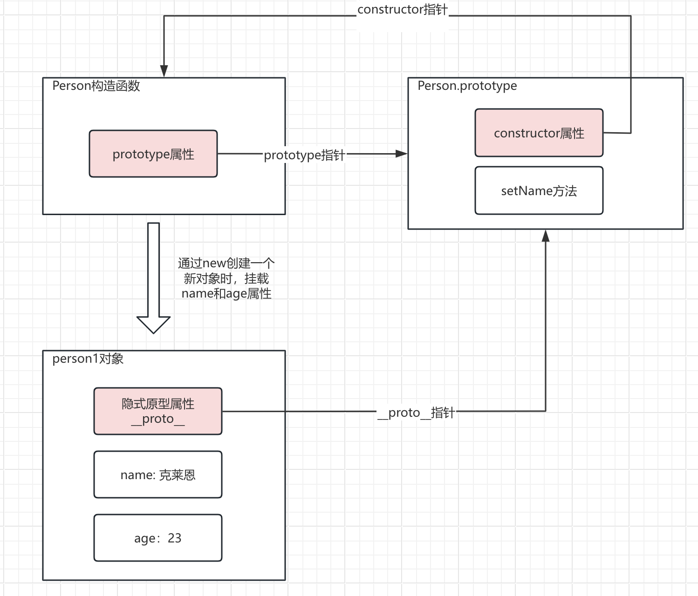
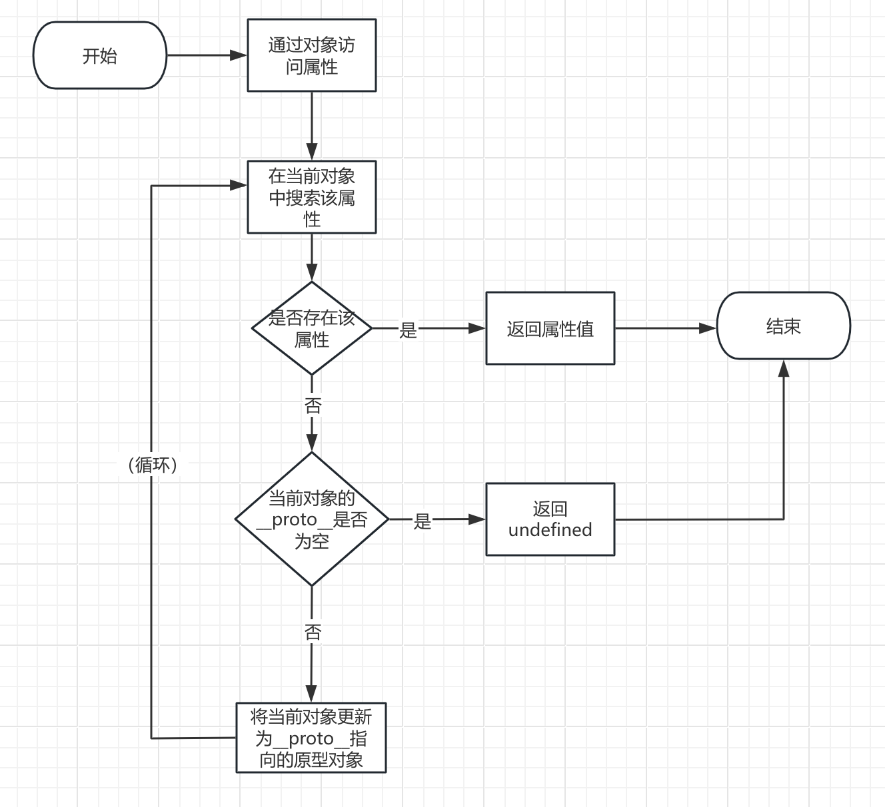
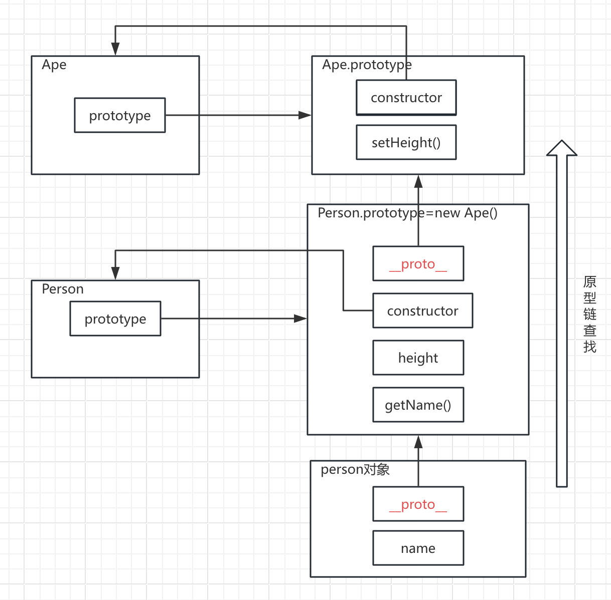

# 速读《JavaScript高级程序设计（第5版）》


接下来，我们以Nodejs为运行环境，将注意力集中到JS语法本身，排除掉所有浏览器相关内容。

## 第3章 语言基础

### 变量

|          | var                                                          | let                                                          |
| -------- | ------------------------------------------------------------ | ------------------------------------------------------------ |
| 作用域   | 函数作用域                                                   | 块级作用域                                                   |
| 变量提升 | var变量声明会自动提升到函数作用域顶部，因此可以先使用再声明。 | let也存在变量提升，**但存在暂时性死区（TDZ）**，在声明前访问会抛 `ReferenceError` |
| 重复声明 | 可以重复声明                                                 | 不能重复声明，报SyntaxError                                  |

- Node.js 顶层 `name = "xxx"` → 隐式全局变量，挂载到 `global`，会污染全局作用域（不推荐）。
- Node.js 顶层 `var name = "xxx"或 let name = "xxx"` → 模块私有变量，不绑定任何对象。
- const的行为和let基本一致，区别在于初始化时必须赋值，并且后续不能修改。
- 为了避免各种自动提升的错误，不再使用var，只使用let，const，优先使用const。


### 数据类型

**（1）数据类型**

| 类型 | Undefined | Null | Boolean    | Number   | String | Object                              | BigInt            | Symbol                   |
| ---- | --------- | ---- | ---------- | -------- | ------ | ----------------------------------- | ----------------- | ------------------------ |
| 值   | undefined | null | true/false | 123，NaN | "abc"  | {name: "张三", age: 25}，new Date() | 123n，BitInt(123) | Symbol()，Symbol('name') |

**（2）Undefined和Null不是一个东西**

undefined表示声明了变量，但没有初始化，Null表示一个空对象指针。他们概念不同却相等（==判断）。

他们在使用场景上不同，undefined不需要显示设置，但是如果一个对象不再使用，需要手动设置null。

**（3）Object属性键是变量时需要使用中括号**

``` js
const keyName = "age";
const user = {
    userName: 'flyzing', 
    [keyName]: 20 //变量属性
};
//测试输出：flyzing:20
console.log(user.userName + ':' + user[keyName]);
```

**（4）BigInt用于处理超过Number.MAX_SAFE_INTEGER的大整数**

BigInt用于处理2的53次方以上的数，大概九千万级别，平时很难用到。

**（5）Symbol用于创建唯一且不可重复的标识符，解决属性名冲突**

字面量只是描述这个符号的用途，即使字面量相同值也不同，Symbol('name')不等于Symbol('name')，因此需要放在常量类里引用。

``` js
//第一步：创建constants.js 统一管理Symbol
export const USER_ID = Symbol('user_id'); //创建我的用户id
export const USER_NAME = Symbol('user_name'); //创建我的用户名

//第二步：业务中导入Symbol使用
import {USER_ID, USER_NAME} from './constants.js'

//第三步：在其他方法中访问Symbol属性
function getUserId(data) {
    return data[USER_ID];
}

const user = {
    [USER_ID]: '1001', //Symbol唯一，不会和任何字符串键冲突
    [USER_NAME]: 'flyzing',
    age: 40
};
//测试输出：1001
console.log(getUserId(user)); 
```


### 操作符

**（1）相等**

先进行强制类型转换再判断值，这种隐式转换容易出错，因此不建议再使用。

``` js
console.log(1 == true); //true先转换为1再比较，返回true
```

**（2）全等**

先判断类型再判断值，类型不同直接返回false，判断更加准确，代替相等。

``` js
console.log(1 === true); //类型不同，返回false
console.log('123' !== 123); //类型不同，返回true
console.log(null === undefined); //类型不同，返回false
```

**（3）空集合并操作**

为处理空值，只给null或undefined提供默认值。使用||操作符提供默认值时，容易被假性值干扰（可以转为false的值，如0，''），因此不建议再使用。

``` js
const values = [null, undefined, 0, ''];
console.log(values.map(x => x || 'default')); 
//输出：[ 'default', 'default', 'default', 'default' ]
console.log(values.map(x => x ?? 'default'));
//输出：[ 'default', 'default', 0, '' ]
```


### 语句

**（1）if语句**

这里的条件表达式可以是任意表达式，js会自动将其转为boolean值，如果为true则执行后续语句。

注意Js中的假性值有false，0，NaN，'', null, undefined，其余值转boolean都返回true。

**（2）for-of语句和for-in语句区别**

for-of用于遍历可迭代对象的元素，for-in用于枚举对象中的非符号键属性，容易出现不可预见的结果，因此不建议使用for-in。

```js
let arr = [1, 2, 3];
for(const el of arr) {
    console.log(el); //依次输出1,2,3
}
for(const propName in arr) {
    //依次输出0,1,2，JS中数组本质是对象，索引就是属性名，这种不可预见的结果导致不建议使用for-in
    console.log(propName); 
}
```

**（3）switch语句**

- js中的switch语句可以用于所有数据类型，不仅限于数字类型。
- case条件值不必须是常量，可以是变量或表达式。
- 在比较每个条件值时会实用全等操作符。因此不会强制转换数据类型。

另外漏掉break会造成穿透，后续case不会再判断直接执行直到遇到break为止，这会造成不可预测的结果，因此建议都带break。

```js
let dynamicVal = "dynamicVal";
function checkValue(val) {
  switch (val) {
    case dynamicVal:
      console.log("这是变量" + val);
      break;
    case 5:
      console.log("这是数字5");
    // break;
    case "5":
      console.log("这是字符串5");
      break;
    default:
      console.log("无匹配");
  }
}
checkValue(5);
//依次输出：这是数字5，这是字符串5
```

### 函数

函数要么有函数值，要么不返回值，只在某个条件下返回值的函数会带来麻烦，尤其是调试时。这在其他语言中编译阶段就会报错，JS不报错但不建议这么做。

```js
//默认返回值兜底
function calculateScore1(isPass) {
  if (isPass) {
    return 100;
  }
  return null; // 显式返回 null，而非隐式 undefined
}

//没有返回值的异常场景
function calculateScore2(isPass) {
  if (!isPass) {
    throw new Error("未通过，无分数"); // 异常场景抛错，终止执行
  }
  return 100; // 正常场景必返回数值
}

console.log(calculateScore1(false)); //null
console.log(calculateScore2(false)); //Error: 未通过，无分数
```


## 第4章 变量、作用域与内存

### 引用类型和值类型

|                   | 值类型                                                       | 引用类型                                                 |
| ----------------- | ------------------------------------------------------------ | -------------------------------------------------------- |
| 存储 / 访问方式   | 直接存储 / 访问“值”本身                                      | 存储 / 访问“值的内存地址”（引用）                        |
| 动态属性          | 不可变，不能动态添加属性                                     | 可以动态添加 / 修改 / 删除属性                           |
| 复制值 / 传递参数 | 创建值的副本，修改互不影响                                   | 创建内存地址的副本，指向同一个对象                       |
| 确定类型          | 使用typeof，返回undefined、object(Null返回)、boolean、number、bigInt、string和symbol | 使用typeof都会返回object，需要使用instanceof判断具体类型 |

### 上下文与作用域

每段代码执行时都有一个执行环境，这就是**执行上下文**（简称上下文）。上下文采用**栈式存储（先进后出）**，执行时**动态变化**。

```
执行上下文 = {
  1. 变量对象/活动对象（VO/AO）：存储变量、函数、arguments → 变量的实际存储位置
  2. 作用域链（Scope Chain）：变量查找的规则 → 按顺序导航到VO/AO中查找变量
  3. this绑定（This Binding）：上下文的核心 → 函数执行时的“归属对象”
}
```

上下文中包含的**作用域链**，采用**链式结构**，核心作用是逐级查找变量，在函数**定义时就已固定（静态）**。

```js
name = "张三"; //绑定在global对象上，全局上下文的VO里
function fn() { // 函数fn的执行上下文：
    let innerVar = '内部变量';
    console.log(this.name); //上下文的核心：this的指向
    console.log(innerVar);  //上下文AO里的变量，通过作用域找到
}
// 1. 全局上下文初始化
// VO: { name: "张三", fn: 函数对象 }
// 作用域链: [全局VO]
// this: global

fn(); // 输出 "张三"，内部变量
// 2. 调用fn，创建fn的上下文：
// AO: { innerVar: "内部变量" }
// 作用域链: [fn的AO → 全局VO]
// this: global

let obj = { name: "李四", fn: fn };
// 3. 全局上下文：新增 obj 变量
// VO: { name: "张三", fn: 函数对象, obj: { name: "李四", fn: fn }}
// 作用域链: [全局VO]
// this: global

obj.fn(); // 输出 "李四"（this变了），内部变量
// 4. 作为对象方法调用，fn的上下文变了（核心是this变，变量规则不变）：
// AO: { innerVar: "内部变量" }
// 作用域链: [fn的AO → 全局VO]（找变量的规则没变）
// this: obj（核心变了）
```

另外，不要使用with改变作用域链，会导致不可预期的结果。

### 垃圾回收

- 离开作用域的值会自动标记为可回收，然后在垃圾回收期间被删除。
- 为促进内存回收，全局对象，全局对象的属性和循环引用都应该在不需要时解除引用。

```js
function setName() {
    // 1. 未用var/let/const声明的name，绑定在全局对象global上，不会被回收，避免使用。
    name = 'flyzing';
}
setName();

let userName = 'flyzing';
const timer = setInterval(() => {
    // 2. 定时器回调函数使用了外部变量userName，定时器一直运行就不会被回收。
    console.log(userName);
}, 1000)
// 因此当不需要时，必须清除定时器
// clearInterval(timer);  // 这样 userName 就可以被回收了

let outer = function() {
    let name = 'flyzing';
    return function() {
        // 3. 在创建闭包时，就保存了外部变量name。不会被回收。
        return name;
    }
}
let fn = outer();  
// 不再使用时需要置为空，fn 被回收，name 才会被回收
fn = null;  // 现在 name 可以被垃圾回收了
```


## 第5章 基本引用类型

### 原始值包装类型

前文提到，JS中变量分为两大类：

- 原始类型：值不可变，存储在栈内存，赋值时是”值拷贝“。包括：String、Number、Boolean、Undefined、Null、Symbol、BigInt。
- 引用类型：值可变，存储在堆内存，赋值时是“引用拷贝”。包括：Object。

原始类型本身是没有属性和方法的，那为什么我们如下使用？

```js
console.log('abc'.length); // 3
console.log(123.456.toFixed(2)); //123.46
console.log(true.toString()); //true
```

这是因为String、Number、Boolean这三个原始类型非常特殊，他们的字面量是原始类型，但可以通过new来创建对应的包装对象是引用类型。当我们使用他们的方法时，JS自动创建临时的包装对象，调用方法，然后立即销毁包装对象（不是等到作用域结束）。

另外，不建议手动创建包装类型，会造成不可预期的错误，如Boolean包装对象即使值是false，在真值判断（如 if/while 条件）中也会被判定为真值。

### 单例内置对象

顾名思义，js开始执行时就存在的，只有一个实例的对象，如下：

- Math 数学工具集，提供计算相关方法（min/max，round，random等）， 无构造器能力。

- JSON 处理JSON序列化/反序列化（parse，stringify），全局唯一的JSON工具对象。
- globalThis ES规范中统一的全局对象（浏览器中等于window，Nodejs中等于global），承载所有全局变量和全局方法，如encodeURIComponent，eval等。

## 第6章 高级引用类型

只关注常用方法，弱引用，定型数组相关都丢掉，后面再看。

### Array常用方法

```js

//1、扩展操作符
//把可迭代元素展开成数组元素，从而更容易的完成数组复制，合并。
const arr1 = [1, 2, 3];
const arr2 = [...arr1, 4, 5, 6];
console.log(arr2); //[ 1, 2, 3, 4, 5, 6 ]

//2、剩余操作符
//用于将数组的剩余元素收集到一个新数组中，通常用于函数参数
function sum(...numbers) {
  //reduce((累加结果, 当前项) => 累加结果 + 当前项, 初始值)
  return numbers.reduce((total, num) => total + num, 0);
}
console.log(sum(1, 2, 3, 4, 5)); //15
//或解构赋值
const [first, second, ...rest] = [1, 2, 3, 4, 5];
console.log(rest); //[ 3, 4, 5 ]

//3、栈方法，提供后进先出（LIFO）的方法，即插入和删除都在栈顶。
let stack = [1, 2];
//push推入栈顶
let count = stack.push(3, 4); 
console.log(`stack length: ${count}`); //stack length: 4
//pop从栈顶取出
console.log(stack.pop()); //4

//4、队列方法，提供先进先出（FIFO）的方法，即在队尾插入，在队首删除。
let queue = [1, 2];
//push加入队尾
count = queue.push(3, 4); 
console.log(`queue length: ${count}`); //queue length: 4
//shift从队首取出
console.log(stack.shift()); //1

//5、排序
let values = [0, 10, 5, 1, 15];
//默认情况下，先调用String()转换函数，再按照字符串升序排序
values.sort(); 
console.log(values); //[ 0, 1, 10, 15, 5 ]
//想要按照数值排序，可以使用比较函数做参数。
//如果第一个参数应该排在第二个参数前面，则返回-1，反之为1，相等为0
values.sort((a, b) => { 
  if (a < b) { //升序
    return -1; 
  } else if (a > b) {
    return 1;
  } else {
    return 0;
  }
});
console.log(values); //[ 0, 1, 5, 10, 15 ]
//简化：
values.sort((a, b) => b - a) //倒序
console.log(values);  //[ 15, 10, 5, 1, 0 ]

//6、截取，不修改原数据
let colors = ['red', 'green', 'blue', 'yellow', 'pink'];
let colors2 = colors.slice(1, 4);
console.log(colors2); //[ 'green', 'blue', 'yellow' ]

//7、万能增删改
//从第0个位置，删除1个元素。
colors = ['red', 'green', 'blue', 'yellow', 'pink'];
let removed = colors.splice(0, 1); 
console.log(removed); //[ 'red' ]
console.log(colors); //[ 'green', 'blue', 'yellow', 'pink' ]
//从第1个位置，删除2个元素，然后在该位置在插入2元素
colors = ['red', 'green', 'blue', 'yellow', 'pink'];
removed = colors.splice(1, 2, 'black', 'gray');
console.log(removed); //[ 'green', 'blue' ]
console.log(colors); //[ 'red', 'black', 'gray', 'yellow', 'pink' ]

//8、查找
//简单查找
let letters = ["a", "b", "c", "d", "b", "f"];
console.log(letters.includes("b")); //true
console.log(letters.indexOf("b")); //1
console.log(letters.lastIndexOf("b")); //4
//使用断言函数查找
const people = [
  {
    name: "克莱恩",
    age: 20,
  },
  {
    name: "奥黛丽",
    age: 18,
  },
  {
    name: "邓恩",
    age: 45,
  },
];
//返回的第一个匹配的元素，同理findIndex方法返回第一个匹配的元素索引
let youngPeople = people.find((element, index, array) => element.age < 25);
console.log(youngPeople); //{ name: '克莱恩', age: 20 }

//9、迭代方法
let numbers = [1, 2, 3, 4, 5];
//遍历数组，每一项函数都返回true，结果才是true
let everyResult = numbers.every((item, index, array) => item > 2);
console.log(everyResult); //false
//遍历数组，有一项函数返回true，结果就是true
let someResult = numbers.some((item, index, array) => item > 2);
console.log(someResult); //true
//遍历数组，函数返回true的项会组成数组后返回
let filterResult = numbers.filter((item, index, array) => item > 2);
console.log(filterResult); //[ 3, 4, 5]
//遍历数组，每次函数调用结果组成数组后返回
let mapResult = numbers.map((item, index, array) => item * 2);
console.log(mapResult); //[ 2, 4, 6, 8, 10]
//遍历数组，代替for
numbers.forEach((item, index, array) => {
    if(item > 2) {
        console.log(item);
    }
});
// 3
// 4
// 5

//10、归并方法（聚合）
let sum = numbers.reduce((pre, cur, index, array) => pre + cur, 0);
console.log(sum); //15

//11、展开方法（拍平）
const arr3 = [1, [2, [3, 4]]];
//第一层： 1, [2, [3, 4]]
//第二层：     2, [3, 4]
//第三层：         3, 4
const flatArr = arr3.flat();//等同于flat(1) 拍一层
//遍历数组，遇到第一层的包裹都拆掉，如[2, [3, 4]]拆成2, [ 3, 4 ]，里面还有一个包裹[3, 4] 不拆
console.log(flatArr); // 1, 2, [ 3, 4 ] ]
//拆完一层后，拆第二层包裹[3, 4] 
console.log(arr3.flat(2)); //[ 1, 2, 3, 4 ]
//Infinity无限大，也就是拆到底
console.log(arr3.flat(Infinity)) //[ 1, 2, 3, 4 ]
const data = [
  { id: 1, items: ['a', 'b'] },
  { id: 2, items: ['c', 'd'] }
];
//先转换数据
const itemsArr = data.map(obj => obj.items);
console.log(itemsArr); //[ [ 'a', 'b' ], [ 'c', 'd' ] ]
//再拍平
console.log(itemsArr.flat()) //[ 'a', 'b', 'c', 'd' ]
//以上两步相当于flatMap
console.log(data.flatMap(obj => obj.items)); //[ 'a', 'b', 'c', 'd' ]

```

### Map常用方法

Map和Object一样都是键值对结构，如果key经常变更，必须保证插入顺序，类似缓存作用使用Map，其他情况使用Object。

```js
//map接受的参数，必须是一个可迭代对象，而且每一项必须是[key, value]格式的数组。
const m = new Map([
  ['key1', 'val1'],
  ['key2', 'val2'],
  ['key3', 'val3'],
]);
console.log(m.has('key1')); //true
m.set('key1', 'hello')
console.log(m.get('key1')); //hello
m.delete('key1');
console.log(m.size); //2
```

### Set常用方法

```JS
const s = new Set(['val1', 'val2', 'val3']);
console.log(s.has('val1')); //true
s.add('val1'); //去重了，不会出现'val1', 'val2', 'val3', 'val1'
console.log(s.size); //3
//最常用：数组去重
const arr = [1, 2, 3, 1, 2, 5, 3];
const uniqueArr = [...new Set(arr)];
console.log(uniqueArr); //[ 1, 2, 3, 5 ]
```

## 第7章 迭代器与生成器

异步迭代部分可以先丢掉，放到后面再看。

### 理解迭代器

核心元素：

- 可迭代对象（Iterable）就是能够被挨个遍历的东西，

- 迭代器（Iterator）就是负责挨个取值的工具。

- 可迭代协议（Iterable Protocol）就是js规定的想要成为可迭代对象，必须满足的规则：（这里只是增强理解，工作中100%用不到）

  规则1：必须有一个Symbol.iterator属性

  规则2：这个属性必须是一个工厂函数，调用它就能返回一个新的迭代器

  规则3：迭代器必须有next()方法，用来取数据

```JS

const arr = [1,2];
for(const num of arr) { //数组迭代
  console.log(num); //输出：1 2
}
// 规则1：数组自带内置的Symbol属性，规则2：这个属性是工厂函数，调用它返回的是一个迭代器
let iter = arr[Symbol.iterator]();
// 规则3：迭代器必须有next方法，返回的结果对象包含value属性和done属性（true表示“耗尽”）
console.log(iter.next()); //{ value: 1, done: false }
console.log(iter.next()); //{ value: 2, done: false }
console.log(iter.next()); //{ value: undefined, done: true }
console.log(iter.next()); //{ value: undefined, done: true }

```

我们可以满足可迭代协议，实现自定义迭代器

```JS
const myIterable = {
  //规则1：必须有一个Symbol.iterator属性
  [Symbol.iterator]() {
    let count = 1;
    return { //规则2：这个属性必须是一个工厂函数，调用它就能返回一个新的迭代器
      next() { //规则3：迭代器必须有next()方法，用来取数据
        if(count <= 2) {
          return {value: count++, done: false};
        } else {
          return {value: undefined, done: true};
        }
      }
    }
  }
}
for (const num of myIterable) { //自定义迭代
  console.log(num); //输出：1 2
}
```

### 理解生成器

生成器是自带迭代器的函数，不用手写 next ()，也就是最简单的迭代器。

注意，函数体中还可以加入return语句，如return 3，作用是提前结束迭代，但是问题是for...of....拿不到return返回值，因此不要用。

```js
//生成器函数（普通函数加个*就是）
function* gen() {
  yield 1; //yield暂停
  yield 2;
}
let g = gen();
console.log(g.next()); //{ value: 1, done: false }
console.log(g.next()); //{ value: 2, done: false }
console.log(g.next()); //{ value: undefined, done: true }
for (let v of gen()) { //生成器迭代
  console.log(v); //输出：1 2
}

//生成器初始化 Map（或Set，Array）
const m2 = new Map({
  //Symbol.iterator元素是一个工厂方法，返回一个迭代器，刚好生成器就是简化的迭代器。
  *[Symbol.iterator]() {
    yield ["key1", "val1"];
    yield ["key2", "val2"];
    yield ["key3", "val3"];
  },
});
for(let e of m2) { //map迭代
  console.log(`key:${e[0]}, value:${e[1]}`);
}
// key:key1, value:val1
// key:key2, value:val2
// key:key3, value:val3

```

## 第8章 对象、类与面向对象编程
核心章节，地毯式覆盖

### 理解对象

**1、对象属性分为两种：数据属性和访问器属性**

（1）数据属性可以通过字面量定义对象时同时定义，也可以通过Object.defineProperties()定义，有4个特性：

- Configurable：可新增，删除，配置特性
- Enumerable：可在for-in循环中返回
- Writable：可修改
- Value：属性值

```js
let person = { name: "克莱恩" };
//最常见的定义对象属性的方式，configurable，enumerable，writable默认为true，value为'克莱恩'，即无任何限制。

let person2 = {};
//使用Object.defineProperties()定义对象属性时，可修改特性，但注意此时configurable，enumerable，writable默认为false
Object.defineProperties(person2, {
  name: {
    writable: false,
    configurable: true, //需手动设置为true，否则默认为false
    enumerable: true, //需手动设置为true，否则默认为false
    value: "克莱恩",
  },
  age: {
    writable: true, //默认不可枚举，不可配置
    value: 25
  }
});
console.log(person2.name); //克莱恩
console.log(person2.age); //25
//可枚举的属性
for (let p in person2) {
  console.log(p); //name
}
//不可修改的属性
person2.name = "奥黛丽";
//TypeError: Cannot assign to read only property 'name' of object '#<Object>'
```

（2）访问器属性不能直接定义，只能通过Object.defineProperties()定义，有4个特性：

- Configurable：可新增，删除，配置特性
- Enumerable：可在for-in循环中返回
- Get：获取函数，读取属性时自动调用，默认undefined
- Set：设置函数，设置属性时自动调用，默认undefined

```js
let book = {
  year_: 2023,
  edition: 1,
};
Object.defineProperties(book, {
  year: {
    get() { //获取函数
      return this.year_;
    },
    set(newValue) { //设置函数
      if (newValue > 2023) {
        this.year_ = newValue;
        this.edition = newValue - 2023;
      }
    },
    //Configurable，Enumerable默认为false
  },
});
book.year = 2026;
console.log(book.edition); //3

//可枚举属性
for (const key in book) {
  console.log(key); //year_ edition （没有year）
}
```

工作中使用更简洁的语法糖，另外，只有get没有set方法就是只读属性，

```js
let book2 = {
  year_: 2023,
  edition: 1,
  get year() { //获取函数
    return this.year_;
  },
  set year(newValue) { //设置函数
    if (newValue > 2023) {
      this.year_ = newValue;
      this.edition = newValue - 2023;
    }
  },
};
book2.year = 2026;
console.log(book2.edition); //3

//读取属性特性
console.log(Object.getOwnPropertyDescriptors(book2));
// {
//   year_: { value: 2026, writable: true, enumerable: true, configurable: true },
//   edition: { value: 3, writable: true, enumerable: true, configurable: true },
//   year: {
//     get: [Function: get year],
//     set: [Function: set year],
//     enumerable: true,
//     configurable: true
//   }
// }
```

**2、访问对象属性**

 ```js
 const person = {
   name: '克莱恩',
   age: 22,
   address: {
     city: '廷根市',
     street: '水仙花街2号'
   }
 }
 //访问属性，使用点或者括号（属性名需要动态确定或包含特殊字符）
 console.log(`姓名：${person.name}，年龄：${person['age']}`); //姓名：克莱恩，年龄：22
 //连缀操作符，用在多层属性
 console.log(person.address.city); //廷根市
 //可选择连缀操作符，用在多层属性可能为空
 console.log(person.brother?.address?.city); //undefined
 ```

**3、对象的静态方法**

（1）锁死对象的三种方法：preventExtensions，seal，freeze，不让别人乱改，以防数据被篡改引起bug。区别是程度由轻到重。

注意：三个方法仅作用于对象本身**，**不影响嵌套对象（浅锁定），而且不可逆。

```js
const obj = { name: "克莱恩" };
//1、禁止扩展，只能改，不能加
try {
  Object.preventExtensions(obj);
  console.log(Object.isExtensible(obj)); //false
  obj.age = 23;
} catch (error) {
  console.log(error); //TypeError: Cannot add property age, object is not extensible
}

//2、封存对象，只能改，不能加，不能删
try {
  Object.seal(obj);
  delete obj.name;
} catch (error) {
  console.log(error); //TypeError: Cannot delete property 'name' of #<Object>
}

//3、冻结对象，不能改，不能加，不能删，只读
try {
  Object.freeze(obj);
  obj.name = '莫雷蒂';
} catch (error) {
  console.log(error); //TypeError: Cannot assign to read only property 'name' of object '#<Object>'
}
```

（2）合并对象的两种方法：Object.assign()和...

注意：两种方式都是浅复制

```js
let person = {};
let name = {name: '克莱恩', age: 23};
let address = { address: {
    city: '廷根市',
    street: '水仙花街2号'
  }};
let result = Object.assign(person, name, address);
//把原对象合并到目标对象上返回
console.log(result === person); //true
//既然第一参数和返回结果是一个对象，就干脆改写下，避免误会，下面的写法更常见：
let result2 = Object.assign({}, name, address);
console.log(result2); //{ name: '克莱恩', age: 23, address: { city: '廷根市', street: '水仙花街2号' } }

//工作中更常用的合并方式，创建新对象合并
let result3 = {...name, ...address};
console.log(result3); //{ name: '克莱恩', age: 23, address: { city: '廷根市', street: '水仙花街2号' } }
```

（3）对象判定Object.is() 修复了===两个bug

```JS
//NaN和NaN不全等
console.log( parseInt('abc') === parseInt('abc') ); //false
//数学计算中+0和-0不同，如 1/+0 = Infinity（正无穷）， 1/-0 = -Infinity（负无穷）
console.log(+0 === -0); //true
//Object.is()方法修复上面两个全等bug
console.log(Object.is(NaN, NaN)); //true
console.log(Object.is(+0, -0)); //false
```

**4、增强的对象方法（语法糖）**

```js
//1、属性简写
let name = "克莱恩";
let person = {
  name,
};
//等同于
person = {
  name: name,
};
console.log(person.name); //克莱恩

//2、可计算属性
const nameKey = "name";
const ageKey = "age";
let person2 = {
  [nameKey]: "奥黛丽",
  [ageKey]: 20,
};
//等同于
person2 = {};
person2[nameKey] = "奥黛丽";
person2[ageKey] = "20";
console.log(person2); //{ name: '奥黛丽', age: 20 }

//3、简写方法名
let person3 = {
  setName(name) {
    console.log(`我的名字是${name}`);
  },
};
//等同于
person3 = {
  setName: function (name) {
    console.log(`我的名字是${name}`);
  },
};
person3.setName("邓恩"); //我的名字是邓恩

//访问器属性简化
person3 = {
  name_: '',
  get name() {
    return this.name_;
  },
  set name(name) {
    this.name_ = name;
  }
}
//等同于
person3 = {name_: ''};
Object.defineProperties(person3, {
  name: {
    get: function() {
      return this.name_;
    },
    set: function(name) {
      this.name_ = name;
    }
  }
});
person3.name = '邓恩';
console.log(`我的名字是${person3.name}`); //我的名字是邓恩
```

**5、对象解构**

快速从对象里把属性拿出来，赋值给变量。

```js
let person = { name: "克莱恩", age: 23 };
//1、普通写法（麻烦）
let name = person.name;
let age = person.age;

//2、解构写法
({ name, age } = person); //如果给事先声明的变量赋值，则赋值表达式必须包括在一对括号中
console.log(`name: ${name}, age: ${age}`); //name:克莱恩, age: 23

{
  //3、重命名
  let { name: userName, age } = person; //name改名为userName
  console.log(`name: ${userName}, age: ${age}`); //name:克莱恩, age: 23
}
{
  //4、默认值
  let { name, age, sex = "男" } = person;
  console.log(`name: ${name}, age: ${age}, sex: ${sex}`); //name:克莱恩, age: 23, sex: 男
}
{
  //5、嵌套解构
  const person = {
    name: "克莱恩",
    age: 22,
    address: {
      city: "廷根市",
      street: "水仙花街2号",
    },
  };
  const {name , age, address: {city, street}} = person;
  console.log(`name: ${name}, age: ${age}, city: ${city}, street: ${street}`); //name: 克莱恩, age: 22, city: 廷根市, street: 水仙花街2号
}
{
  //6、参数上下文匹配
  function printPerson(number, {name, age}, salary) {
    console.log(`No.${number} name: ${name}, age: ${age}, salary: ${salary}`);
  }
  printPerson(1, person, '20金榜/月'); //No.1 name: 克莱恩, age: 23, salary: 20金榜/月
}

```

**6、剩余操作符和扩展操作符**

....既是剩余操作符又是扩展操作符，作用不同区分，它们不仅可以用于数组，也可以用于对象。

```js
const person = {
  name: "克莱恩",
  age: 22,
  address: {
    city: "廷根市",
    street: "水仙花街2号",
  },
};
//1、剩余操作符：出现在等号左边或函数参数里，作用是把零散属性，打包成一个对象或数组
const { name, ...remainingData } = person;
console.log(remainingData); //{ age: 22, address: { city: '廷根市', street: '水仙花街2号' } }
{
  const { ...remainingData } = person;
  console.log(remainingData); //{ name: '克莱恩', age: 22, address: { city: '廷根市', street: '水仙花街2号' } }
  //复制的对象和原对象属性相同，但不是同一个
  console.log(remainingData === person); //false
  //浅拷贝，嵌套属性是同一个
  console.log(remainingData.address === person.address); //true
}

//2、扩展操作符：出现在等号右边或函数调用时，作用是把一个对象或数组，拆成零散属性
const family = {
  brather: {
    name: "班森",
    age: 25,
  },
  sister: {
    name: "梅丽莎",
    age: 16,
  },
};
const person4 = {...person, sex: '男', salary: '20英镑/月', ...family};
console.log(person4);
// {
//   name: '克莱恩',
//   age: 22,
//   address: { city: '廷根市', street: '水仙花街2号' },
//   sex: '男',
//   salary: '20英镑/月',
//   brather: { name: '班森', age: 25 },
//   sister: { name: '梅丽莎', age: 16 }
// }
```

### 创建对象

**1、构造函数模式**

```js
//构造函数模式
function Person(name, age) {
  this.name = name;
  this.age = age;
  this.sayName = function() {
    console.log(this.name);
  }
}

let person1 = new Person('克莱恩', 23);
let person2 = new Person('奥黛丽', 20);
person1.sayName(); //克莱恩
person2.sayName(); //奥黛丽
//同样的方法，重复创建，浪费空间
console.log(person1.sayName === person2.sayName); //false
```

使用new操作符，调用构造函数会执行以下操作：

（1）在内存中创建一个对象

（2）这个新对象的`__proto__`属性被赋值为构造函数的prototype属性

（3）构造函数内部的this指向新对象

（4）执行构造函数内部的代码

（5）如果构造函数返回非空对象，则返回该对象；否则，返回刚创建的新对象

要理解这段话，必须得先理解以下3个概念：

```js
//1、函数的prototype属性
function hello() {} 
//每个函数（含普通函数、构造函数）天生自带 prototype 属性，声明即存在，默认是一个空原型对象
console.log(hello.prototype); //{}
//函数自带的 prototype 属性，普通函数直接调用时用不上；
//当函数被 new 当作构造函数调用时，它就成为实例的公共原型仓库，所有 new 出来的实例共享这里的属性和方法。

//2、对象的__proto__属性
let obj = {}; //等价于 let obj = new Object();
//每个对象都有__proto__属性，它是一个指针，指向它的构造函数的prototype属性，那么就可以用这个公共仓库里的属性和方法。
console.log(obj.__proto__ === Object.prototype); //true

//3、this是函数调用时的上下文参数，动态绑定
function sayThis() {
  console.log(this);
  console.log(this.name);
}
let obj2 = { sayThis, name: '克莱恩' }; //sayThis函数中的this指向obj2
obj2.sayThis();
// { sayThis: [Function: sayThis], name: '克莱恩' } 就是obj2
// 克莱恩
```

构造函数模式的缺陷：实例方法定义在构造函数内部，每次 `new` 都会创建独立函数副本，内存冗余、无法复用。如果把公用方法挂载到 构造函数的 `prototype` 原型对象上，所有实例就可以共享同一个方法。这就是原型模式。

**2、构造函数模式 + 原型模式**

```js
//构造函数
function Person(name, age) {
  //【自身属性】每个实例独立拥有
  this.name = name;
  this.age = age;
}
//【共享方法】挂载构造函数的原型上
Person.prototype.sayName = function() {
   console.log(this.name);
}

let person1 = new Person('克莱恩', 23);
let person2 = new Person('奥黛丽', 20);
person1.sayName(); //克莱恩
person2.sayName(); //奥黛丽
//核心：原型上的方法是所有实例共享的，不是独立副本
console.log(person1.sayName === person2.sayName); //true
```

（1）理解原型

 

- 每次创建构造函数都会创建一个原型对象prototype，用于让所有实例共享属性和方法，节省内存。
- 原型对象自带有constructor属性，指回函数本身，可以用于判断类型。
- 每个实例对象内部都有一个隐形原型属性`__proto__`指向构造函数的原型对象，用于让对象可以根据原型链查找上层方法和属性。

```js
function Person() {}
//在原型上添加属性和方法，以供所有实例对象共享
Person.prototype.name = '克莱恩';
Person.prototype.age = 23;
let person1 = new Person();
let person2 = new Person();
//对象不同，但是name属性都是属于原型中的同一个属性
console.log(person1.name === person2.name);
//检查原型
console.log(Person.prototype.isPrototypeOf(person1)); //true
//__proto__是私有变量，需要通过getPrototypeOf方法获取原型
console.log(Object.getPrototypeOf(person2)); //{ name: '克莱恩', age: 23 }
//通过setPrototypeOf方法可以修改对象原型
let newPrototype = { 
    name: '奥黛丽',
    age: 20
};
Object.setPrototypeOf(person1, newPrototype);
console.log(person1.name); //奥黛丽
console.log(person2.name); //克莱恩
```

（2）原形层级



```js
function Person() {}
Person.prototype.name = '克莱恩';
let person1 = new Person();
person1.name = '奥黛丽'
//优先找当前对象中的name属性
console.log(person1.name); //奥黛丽
console.log(person1.hasOwnProperty('name')); //true
//删除当前对象的name属性
delete person1.name;
//当前对象没有，接着查找原型对象的name属性
console.log(person1.name); //克莱恩
console.log(person1.hasOwnProperty('name')); //false
```

（3）原型和in操作符

```js
function Person() {}
Person.prototype.name = '克莱恩';
let person1 = new Person();
person1.age = 23;
//只要对象可以访问，in操作符就返回true
console.log('name' in person1); //true
//hasOwnProperty可以判断是否为当前实例对象的属性
console.log(person1.hasOwnProperty('name')); //false
//同理我们可以写一个判断是否为原型对象属性的方法
function hasPrototypeProperty(object, name) {
    //不是当前实例的属性，并且对象可以访问到的属性就是原型对象的属性
    return !object.hasOwnProperty(name) && (name in object);
}
console.log(hasPrototypeProperty(person1, 'name')); //true
//for...in...遍历对象自身+原型链上所有可枚举属性，注意遍历数组应该使用for...of...
for(let prop in person1) {
    console.log(prop); //age name
}
//为了避免for...in...遍历范围不可控，可以使用Object.keys或Object.getOwnPropertyNames代替
//Object.keys获取当前对象实例的可枚举属性
console.log(Object.keys(person1)); //[ 'age' ]
console.log(Object.keys(Person.prototype)); //[ 'name' ]
//Object.getOwnPropertyNames获取当前对象实例的所有属性（包括不可枚举属性）
console.log(Object.getOwnPropertyNames(person1)); //[ 'age' ]
//可以遍历出不可枚举属性constructor
console.log(Object.getOwnPropertyNames(Person.prototype)); //[ 'constructor', 'name' ]
```

（4）对象迭代

```js
//Object.values()和Object.entries()方法用于将对象转换为序列化且可迭代的格式，不包括符号属性。
let person = {name: '克莱恩', age: 23};
//Object.values()返回对象值数组
console.log(Object.values(person)); //[ '克莱恩', 23 ]
//Object.entries()返回键值对数组，
let personEntries = Object.entries(person);
console.log(personEntries); //[ [ 'name', '克莱恩' ], [ 'age', 23 ] ]
//工作中Object.entries() + for...of...适合遍历键值对
for(const [key, value] of Object.entries(person)) {
    console.log(key, value);
}
// name 克莱恩
// age 23
//Object.fromEntries()可以基于键值对数组构建对象，和Object.entries()作用相反
let person2 = Object.fromEntries(personEntries);
console.log(person2); //{ name: '克莱恩', age: 23 }
//工作中Object.fromEntries()适合将Map转为对象
const personMap = new Map();
personMap.set('name', '克莱恩');
personMap.set('age', 23);
let person3 = Object.fromEntries(personMap);
console.log(person3); //{ name: '克莱恩', age: 23 }
```

（5）原型的动态性

```js
function Person() {}
//先创建实例
let person1 = new Person();
//后在原型上定义方法
Person.prototype.sayHi = function() {
    console.log('hi');
}
//依然可以调用sayHi
//这是因为实例对象查找方法依靠本身的隐性原型指针__proto__动态查找真正引用的原型对象
//实例对象中并没有原型对象的副本。
person1.sayHi(); //hi
//但是如果将Person的原型对象整个替换
Person.prototype = {
    constructor: Person,
  	//新方法
    sayNo: function() {
        console.log('no');
    }
}
try {
    //调用新方法则报错，这是因为person1内的原型指针还是指向的之前的原型对象
    person1.sayNo(); //TypeError: person.sayNo is not a functio
} catch(error) {
    console.log(error);
}
//创建一个新对象
let person2 = new Person();
//可以调用新方法，这是因为新的对象内的原型指针指向了新的原型对象
person2.sayNo(); //no
```

**3、原型继承**



```js
//猿
function Ape() {
    this.height = 130;
}
Ape.prototype.getHeight = function() {
    return this.height;
}
//人
function Person(name){
    this.name = name;
}
//1、通过改变原型对象的方式继承父类属性和方法
Person.prototype = new Ape();
//覆盖constructor，防止Person.prototype.constructor指向Ape
Person.prototype.constructor = Person;
//2、子类再实现自己的新方法
Person.prototype.getName = function() {
    return this.name;
}
let person1 = new Person('克莱恩');
//3、实例对象先查找自身属性，如果没有则通过隐性原型指针__proto__在原型链上查找属性和方法
console.log(person1.getHeight()); //130
console.log(person1.getName()); //克莱恩
//4、想要通过实例对象修改原型的属性
person1.height = 175;
console.log(person1.height); //175
let person2 = new Person('奥黛丽');
//5、发现修改不起作用，实际上只有获取属性时才需要沿着原型链往上找，
// 在设置属性时如果当前实例没有，就在当前实例设置，不影响原型对象。
console.log(person2.height); //130
//6、修改原型属性的正确方式
Person.prototype.height = 175;
console.log(person1.height); //175
console.log(person2.height);  //175
//7、原型和继承关系
//如果一个实例的原型链中出现过相应的构造函数，则instanceof和构造函数.prototype.isPrototypeOf()都会返回true
console.log(person1 instanceof Object); //true
console.log(person1 instanceof Ape); //true
console.log(person1 instanceof Person); //true
console.log(Object.prototype.isPrototypeOf(person1)); //true
console.log(Ape.prototype.isPrototypeOf(person1)); //true
console.log(Person.prototype.isPrototypeOf(person1)); //true
```

通过上面的代码，可以看出原型继承存在两个缺陷：

- 如果在原型对象中存放属性，则这些属性就会变成共享属性，一旦修改，所有的实例对象属性都会改变。这个问题通过只在原型对象中存放方法，属性存放在实例中解决。
- 原型对象构造函数无法传参，如：Ape构造函数无法传参height（这里只能固定写死，如130），子类实例只能继承这个固定值，无法个性化设置。

两大问题的解决方案（组合继承）

```js
//父类（猿），属性在构造函数（实例），方法在原型
function Ape(height) {
    this.height = height;
}
Ape.prototype.getHeight = function() {
    return this.height;
}
//子类（人），借用父类构造函数传参 + 原型继承方法
function Person(name, height){
    //核心：借用父类构造函数，给每个实例独立传参
    Ape.call(this, height);  //height属性在Person构造函数调用时，动态加载到创建出来的对象上
    this.name = name;
}

//正确绑定原型链，不共用父实例
//注意这里不是Person.prototype = new Ape();，创造出来的原型对象类没有height属性
Person.prototype = Object.create(Ape.prototype);
Person.prototype.constructor = Person;
Person.prototype.getName = function() {
  return this.name;
};

// 验证：实例独立，可个性化设置
const p1 = new Person('克莱恩', 175);
const p2 = new Person('奥黛丽', 165);
console.log(p1.getName(), p1.getHeight()); // 克莱恩 175
console.log(p2.getName(), p2.getHeight()); // 奥黛丽 165
```

### 类

**1、类定义**

```js
//1、定义类的方法有两种：
//类声明
class Animal {}
//类表达式
const Zoo = class {};

//2、函数声明提升 与 类声明提升
console.log(PersonFn); //undefined 
//var变量声明（函数表达式）只提升变量名，不提升赋值，因此不报错，只返回未定义
var PersonFn  = function() {};

console.log(ApeFn); //[Function: ApeFn] 
//函数声明会整体提升，因此可以声明前使用。
function ApeFn() {}

console.log(Person); //undefined
//var变量声明，依然只提升变量名
var Person = class {}

console.log(Ape); //ReferenceError: Cannot access 'Ape' before initialization
//但是类声明整体都不能提升，因此声明前使用报错
class Ape {}
```

**2、类的构成**
类可以包含构造函数方法，实例方法，获取函数，设置函数和静态类方法。

```js
class Person {
  //构造函数方法
  constructor() {
    this.name_ = '';
  }

  //实例方法
  sayHi() {
    console.log("你好");
  }

  //获取函数
  get name() {
    return this.name_;
  }

  //设置函数
  set name(name) {
    this.name_ = name;
  }

  //静态函数
  static sayNo() {
    console.log("不");
  }
}

let person = new Person();
person.name = '克莱恩';
console.log(person.name); //克莱恩
person.sayHi(); //你好
Person.sayNo(); //不
```

类名称表达式是可选的，把类表达式赋值给变量后，可以通过name属性获取类表达式的名称，但不能在类表达式作用于外部访问这个标识符。

```JS
//类声明（建议使用这种）
class Person1 {}
//匿名类表达式
let Person2 = class {};
//命名类表达式，Person3外部使用，PersonName内部使用
let Person3 = class PersonName {
  sayHi() {
    //类声明的name属性，直接指向类名（Person1），输出"Person1"
    console.log(Person1.name); //Person1
    //匿名类无内部标识符，其name属性默认指向接收它的变量名（Person2），因此输出"Person2"
    console.log(Person2.name); //Person2
    //Person3是变量标识符，指向命名类表达式，其name属性会指向类的内部标识符（PersonName），因此Person3.name输出"PersonName"。
    console.log(Person3.name, PersonName.name); //PersonName PersonName
  }
};
let person = new Person3();
person.sayHi(); 
//外部不能使用PersonName
let p = new PersonName(); //ReferenceError: PersonName is not defined
```

**3、类构造函数**

```js
class Person {
  constructor(name) {
    this.name_ = name;
  }
  sayName() {
    console.log(this.name_);
  }
}
//1、只能使用new调用类的构造函数，执行过程：
//（1）在内存中创建一个对象
//（2）在这个对象内部的隐形原型指针__proto__被赋值为构造函数的prototype属性
//（3）构造函数内部this被赋值为新对象
//（4）执行构造器内部代码
//（5）如果构造函数返回为空对象，则返回此对象；否则，返回刚创建的新对象。
let person = new Person("克莱恩");
person.sayName(); //克莱恩

//2、类就是一个特殊的构造函数
function Ape() {}
console.log(typeof Ape); //function
//Person和Ape一样都是函数
console.log(typeof Person); //function
//一样有原型对象，原型对象里面一样有一个constructor属性指向构造函数（这里是类）本身
console.log(Person === Person.prototype.constructor); //true

//3、既然类是一种特殊的构造函数，也就可以作为参数一样传递
let classList = [
  class {
    constructor(id) {
      this.id_ = id;
      console.log(`instance ${this.id_}`);
    }
  },
];
function createInstance(classDefinition, id) {
  return new classDefinition(id);
}
let person2 = createInstance(classList[0], 9527); //instance 9527

//4、和立即调用函数表达式类似，类也可以立即实例化
let ape = new (class Ape {
  constructor(name) {
    this.name_ = name;
  }
  sayName() {
    console.log(this.name_);
  }
})("卷毛狒狒");
ape.sayName(); //卷毛狒狒
```

**4、实例、原型和类成员** 


